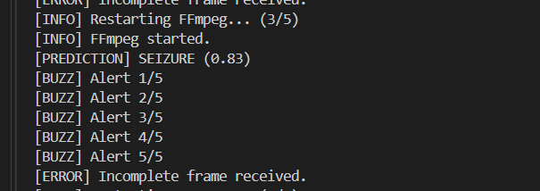
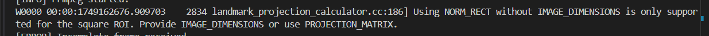
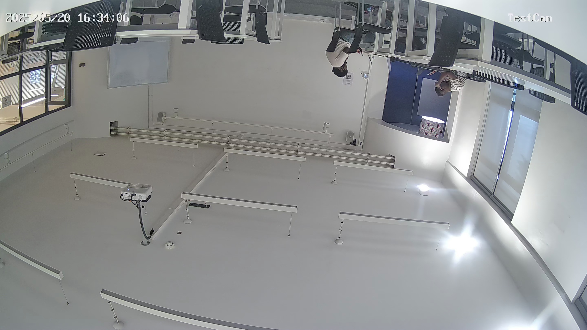

# Real-Time Seizure Detection Using Pose Estimation and TFLite



This project implements a real-time seizure detection system using an RTSP camera feed, pose landmark extraction with MediaPipe, and a TensorFlow Lite model. It is designed to run on a Raspberry Pi and includes buzzer alerts when seizure events are detected.

---

## Relevant Links
- [Notebook for Data prep and EDA](https://colab.research.google.com/drive/1QYHZ_VQo9THJQWKK6x_FUeq7tYCn8fC7?usp=sharing)
- [Notebook for Final Reported Model](https://colab.research.google.com/drive/17U-En9VbbQxZGF3VF0IfJcvyikaMIZP1?usp=sharing)
- [Demo Video](https://drive.google.com/file/d/16w0BA4epHzXPHgxbVq_TlqtMLGdNkbLQ/view?usp=sharing)
- [Link to repo](https://github.com/Isaiah-Essien/uboho_rpi)
  

## Overview


The system is tailored for use in medical or research settings where real-time seizure prediction is essential. It continuously processes live video, detects body posture, and identifies seizure patterns using machine learning.

---

## Features

- Connects to RTSP-enabled cameras for live video input.
- Extracts human pose landmarks from frames using MediaPipe.
- Processes data using a sliding window approach.
- Classifies seizure vs. no-seizure using a pre-trained TFLite model.
- Triggers a buzzer alert using Raspberry Pi GPIO when a seizure is detected.
- Automatically restarts FFmpeg stream if the connection drops.
- Includes graceful shutdown via signal handling.

---

## Folder Structure
uboho_rpi/
│
├── images/
│   ├── 20250520T163334_Test_camera.jpg
│   ├── 20250520T163345_Test_camera.jpg
│   ├── ...
│
├── model/
│   ├── multihead_attention_model_raw_pose.tflite
│   ├── scaler_mean.npy
│   ├── scaler_scale.npy
│   ├── scaler_features.txt
│
├── resources/
│   └── setup.json
│
├── buzzer_test.py         # Script to test buzzer hardware
├── main.py                # (Optional) Entry point or setup controller
├── prediction.py          # Main seizure detection script
├── package_checker.py     # Verifies installed dependencies
├── requirements.json      # List of required Python packages


## Requirements

**Hardware:**
- Raspberry Pi with GPIO support
- RTSP-compatible camera
- Buzzer connected to GPIO pin 17

**Software:**
- Python 3.7+
- FFmpeg installed on system

**Python Packages:**
Install required packages:

```bash
pip install -r requirements.json

```
